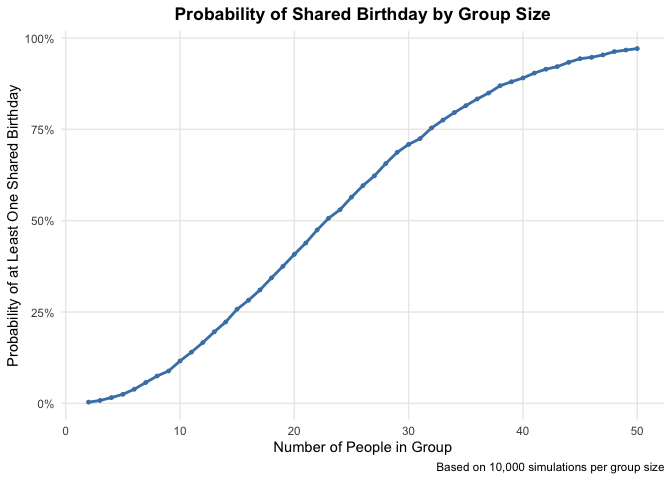
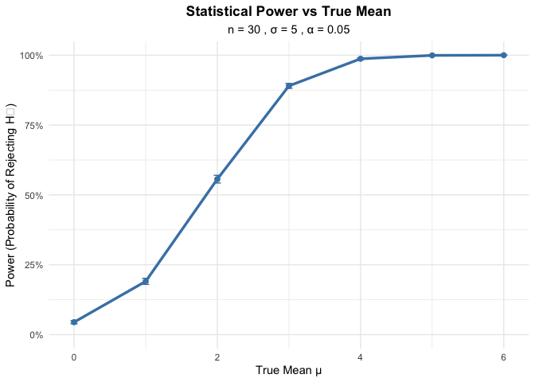
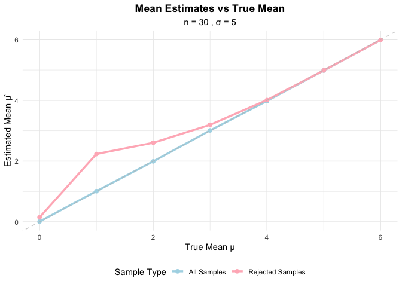
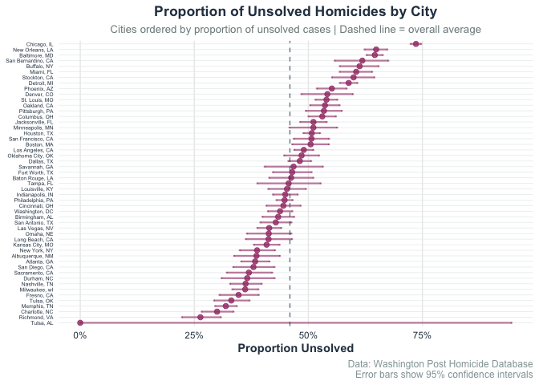

p8105_mtp_xz3499
================
Xintong Zhao
2025-11-01

``` r
library(tidyverse)
library(ggplot2)
library(broom)
library(knitr)
```

## Problem 1

``` r
check_duplicate_birthdays <- function(n) {
  birthdays <- sample(1:365, size = n, replace = TRUE)
  repeated_bday = length(unique(birthdays)) < n
  repeated_bday
}

set.seed(123)

birthday_sim_results <- expand_grid(
  group_size = 2:50,
  iteration = 1:10000
) %>%
  mutate(
    has_duplicate = map_lgl(group_size, check_duplicate_birthdays)
  ) %>%
  group_by(group_size) %>%
  summarize(
    prob_duplicate = mean(has_duplicate)
  )

birthday_plot <- birthday_sim_results %>%
  ggplot(aes(x = group_size, y = prob_duplicate)) +
  geom_line(color = "steelblue", size = 1) +
  geom_point(color = "steelblue", size = 1) +
  labs(
    title = "Probability of Shared Birthday by Group Size",
    x = "Number of People in Group",
    y = "Probability of at Least One Shared Birthday",
    caption = "Based on 10,000 simulations per group size"
  ) +
  theme_minimal() +
  scale_y_continuous(labels = scales::percent_format()) +
  theme(
    plot.title = element_text(hjust = 0.5, face = "bold"),
    panel.grid.minor = element_blank()
  )

birthday_plot
```

<!-- -->

Comment:

The probability curve grows rapidly in an S shape. When the number of
people in a group is 23, the probability exceeds 50%. When the number of
people in a group is around 40, the probability exceeds 90%. This goes
against our intuition that 183 people are needed to have a 50% chance.
This is because as the number of people increases, the possible number
of birthday pairings grows exponentially, causing the probability of
repetition to increase rapidly.

## Problem 2

``` r
n <- 30
sigma <- 5
alpha <- 0.05
mu_values <- c(0, 1, 2, 3, 4, 5, 6)
n_sims <- 5000

# Function to simulate data and perform t-test
simulate_ttest <- function(mu, n, sigma) {
  data <- rnorm(n, mean = mu, sd = sigma)
  test_result <- t.test(data, mu = 0)
  tidy_result <- broom::tidy(test_result)
  
  return(tibble(
    mu_hat = tidy_result$estimate,
    p_value = tidy_result$p.value
  ))
}

set.seed(123)

power_sim_results <- expand_grid(
  true_mu = mu_values,
  iter = 1:n_sims
) %>%
  mutate(
    test_results = map(true_mu, ~ simulate_ttest(.x, n, sigma))
  ) %>%
  unnest(test_results) %>%
  mutate(
    rejected = p_value < alpha
  )
```

### The power of the test

``` r
power_curve <- power_sim_results %>%
  group_by(true_mu) %>%
  summarize(
    power = mean(rejected),
    se_power = sqrt(power * (1 - power) / n())
  ) %>%
  ggplot(aes(x = true_mu, y = power)) +
  geom_line(color = "steelblue", size = 1.2) +
  geom_point(color = "steelblue", size = 2) +
  geom_errorbar(aes(ymin = power - 1.96 * se_power, 
                    ymax = power + 1.96 * se_power), 
                width = 0.1, color = "steelblue") +
  labs(
    title = "Statistical Power vs True Mean",
    subtitle = paste("n =", n, ", σ =", sigma, ", α =", alpha),
    x = "True Mean μ",
    y = "Power (Probability of Rejecting H₀)"
  ) +
  scale_y_continuous(limits = c(0, 1), labels = scales::percent_format()) +
  theme_minimal() +
  theme(
    plot.title = element_text(hjust = 0.5, face = "bold"),
    plot.subtitle = element_text(hjust = 0.5)
  )

print(power_curve)
```

<!-- -->

Description:

The statistical Power increases rapidly with the increase of the True
Mean (μ). The efficacy exceeds 50% approximately when μ = 2, exceeds 80%
when μ = 3, and almost reaches 100% when μ ≥ 4. This is because the
larger the effect size, the easier it is for the sample mean to deviate
from the expected value (μ₀) under the null hypothesis, and thus it is
more likely to be detected by statistical tests.

### Mean estimation comparison

``` r
mean_estimates <- power_sim_results %>%
  group_by(true_mu) %>%
  summarize(
    overall_mean = mean(mu_hat),
    rejected_mean = mean(mu_hat[rejected])
  )

estimate_plot <- ggplot(mean_estimates, aes(x = true_mu)) +
  geom_line(aes(y = overall_mean, color = "All Samples"), size = 1.2) +
  geom_point(aes(y = overall_mean, color = "All Samples"), size = 2) +
  geom_line(aes(y = rejected_mean, color = "Rejected Samples"), size = 1.2) +
  geom_point(aes(y = rejected_mean, color = "Rejected Samples"), size = 2) +
  geom_abline(slope = 1, intercept = 0, linetype = "dashed", 
              color = "gray", alpha = 0.7) +
  labs(
    title = "Mean Estimates vs True Mean",
    subtitle = paste("n =", n, ", σ =", sigma),
    x = "True Mean μ",
    y = "Estimated Mean μ̂",
    color = "Sample Type"
  ) +
  scale_color_manual(values = c("All Samples" = "lightblue", 
                               "Rejected Samples" = "lightpink")) +
  theme_minimal() +
  theme(
    plot.title = element_text(hjust = 0.5, face = "bold"),
    plot.subtitle = element_text(hjust = 0.5),
    legend.position = "bottom"
  )

print(estimate_plot)
```

<!-- -->

Description:

When μ is small (0 to 2), the number of rejected samples is higher than
that of all samples and above the dotted line of the true mean, which
means that the samples that reject the null hypothesis tend to have a
higher estimated mean. When μ is large (≥3), the two lines almost
coincide, and the estimated value is close to the true μ. This is
because when the effect size is small, the null hypothesis will only be
rejected when the sample mean is unexpectedly high. Therefore, the
average estimate of the rejected sample will be systematically high
(selective bias). When the effect size is large enough, almost all
samples can reject the null hypothesis. At this point, the rejected
samples are almost consistent with the population sample, and the bias
disappears.

## Problem 3

``` r
homicide_data <- read_csv("data/homicide-data.csv")

summary(homicide_data)
```

    ##      uid            reported_date       victim_last        victim_first      
    ##  Length:52179       Min.   : 20070101   Length:52179       Length:52179      
    ##  Class :character   1st Qu.: 20100318   Class :character   Class :character  
    ##  Mode  :character   Median : 20121216   Mode  :character   Mode  :character  
    ##                     Mean   : 20130899                                        
    ##                     3rd Qu.: 20150911                                        
    ##                     Max.   :201511105                                        
    ##                                                                              
    ##  victim_race         victim_age         victim_sex            city          
    ##  Length:52179       Length:52179       Length:52179       Length:52179      
    ##  Class :character   Class :character   Class :character   Class :character  
    ##  Mode  :character   Mode  :character   Mode  :character   Mode  :character  
    ##                                                                             
    ##                                                                             
    ##                                                                             
    ##                                                                             
    ##     state                lat             lon          disposition       
    ##  Length:52179       Min.   :25.73   Min.   :-122.51   Length:52179      
    ##  Class :character   1st Qu.:33.77   1st Qu.: -96.00   Class :character  
    ##  Mode  :character   Median :38.52   Median : -87.71   Mode  :character  
    ##                     Mean   :37.03   Mean   : -91.47                     
    ##                     3rd Qu.:40.03   3rd Qu.: -81.76                     
    ##                     Max.   :45.05   Max.   : -71.01                     
    ##                     NA's   :60      NA's   :60

Description:

The original dataset of this homicide case contains
`nrow(homicide_data)` records, spanning from January 1, 2007 to November
5, 2015. The data includes case identification information, detailed
information of the victim (including name, race, age and gender),
geographic information (city, state and longitude and latitude
coordinates of occurrence), as well as the handling status of the case.
Among them, there are 60 missing values in the longitude and latitude
coordinates, the age of the victim is stored in character form, and
there is an abnormal entry of 9 digits in the maximum report date. In
addition, the data integrity of other variables is relatively good, and
it completely records the details of homicide cases in multiple cities
in the United States over the past nine years.

``` r
homicide_summary <- homicide_data %>%
  mutate(
    city_state = paste(city, state, sep = ", ")
  ) %>%
  group_by(city_state) %>%
  summarize(
    total_homicides = n(),
    unsolved_homicides = sum(disposition %in% c("Closed without arrest", "Open/No arrest"))
  ) %>%
  filter(total_homicides > 0) 
```

``` r
baltimore_data <- homicide_summary %>%
  filter(city_state == "Baltimore, MD")

baltimore_test <- prop.test(
  x = baltimore_data$unsolved_homicides,
  n = baltimore_data$total_homicides
)

baltimore_results <- broom::tidy(baltimore_test) %>%
  select(estimate, conf.low, conf.high) %>%
  mutate(city_state = "Baltimore, MD")

kable(baltimore_results)
```

|  estimate |  conf.low | conf.high | city_state    |
|----------:|----------:|----------:|:--------------|
| 0.6455607 | 0.6275625 | 0.6631599 | Baltimore, MD |

``` r
all_city_tests <- homicide_summary %>%
  mutate(
    test_results = map2(unsolved_homicides, total_homicides,
                       ~broom::tidy(prop.test(x = .x, n = .y)))
  ) %>%
  unnest(test_results) %>%
  select(city_state, total_homicides, unsolved_homicides, 
         estimate, conf.low, conf.high)

kable(all_city_tests)
```

| city_state | total_homicides | unsolved_homicides | estimate | conf.low | conf.high |
|:---|---:|---:|---:|---:|---:|
| Albuquerque, NM | 378 | 146 | 0.3862434 | 0.3372604 | 0.4375766 |
| Atlanta, GA | 973 | 373 | 0.3833505 | 0.3528119 | 0.4148219 |
| Baltimore, MD | 2827 | 1825 | 0.6455607 | 0.6275625 | 0.6631599 |
| Baton Rouge, LA | 424 | 196 | 0.4622642 | 0.4141987 | 0.5110240 |
| Birmingham, AL | 800 | 347 | 0.4337500 | 0.3991889 | 0.4689557 |
| Boston, MA | 614 | 310 | 0.5048860 | 0.4646219 | 0.5450881 |
| Buffalo, NY | 521 | 319 | 0.6122841 | 0.5687990 | 0.6540879 |
| Charlotte, NC | 687 | 206 | 0.2998544 | 0.2660820 | 0.3358999 |
| Chicago, IL | 5535 | 4073 | 0.7358627 | 0.7239959 | 0.7473998 |
| Cincinnati, OH | 694 | 309 | 0.4452450 | 0.4079606 | 0.4831439 |
| Columbus, OH | 1084 | 575 | 0.5304428 | 0.5002167 | 0.5604506 |
| Dallas, TX | 1567 | 754 | 0.4811742 | 0.4561942 | 0.5062475 |
| Denver, CO | 312 | 169 | 0.5416667 | 0.4846098 | 0.5976807 |
| Detroit, MI | 2519 | 1482 | 0.5883287 | 0.5687903 | 0.6075953 |
| Durham, NC | 276 | 101 | 0.3659420 | 0.3095874 | 0.4260936 |
| Fort Worth, TX | 549 | 255 | 0.4644809 | 0.4222542 | 0.5072119 |
| Fresno, CA | 487 | 169 | 0.3470226 | 0.3051013 | 0.3913963 |
| Houston, TX | 2942 | 1493 | 0.5074779 | 0.4892447 | 0.5256914 |
| Indianapolis, IN | 1322 | 594 | 0.4493192 | 0.4223156 | 0.4766207 |
| Jacksonville, FL | 1168 | 597 | 0.5111301 | 0.4820460 | 0.5401402 |
| Kansas City, MO | 1190 | 486 | 0.4084034 | 0.3803996 | 0.4370054 |
| Las Vegas, NV | 1381 | 572 | 0.4141926 | 0.3881284 | 0.4407395 |
| Long Beach, CA | 378 | 156 | 0.4126984 | 0.3629026 | 0.4642973 |
| Los Angeles, CA | 2257 | 1106 | 0.4900310 | 0.4692208 | 0.5108754 |
| Louisville, KY | 576 | 261 | 0.4531250 | 0.4120609 | 0.4948235 |
| Memphis, TN | 1514 | 483 | 0.3190225 | 0.2957047 | 0.3432691 |
| Miami, FL | 744 | 450 | 0.6048387 | 0.5685783 | 0.6400015 |
| Milwaukee, wI | 1115 | 403 | 0.3614350 | 0.3333172 | 0.3905194 |
| Minneapolis, MN | 366 | 187 | 0.5109290 | 0.4585150 | 0.5631099 |
| Nashville, TN | 767 | 278 | 0.3624511 | 0.3285592 | 0.3977401 |
| New Orleans, LA | 1434 | 930 | 0.6485356 | 0.6231048 | 0.6731615 |
| New York, NY | 627 | 243 | 0.3875598 | 0.3494421 | 0.4270755 |
| Oakland, CA | 947 | 508 | 0.5364308 | 0.5040588 | 0.5685037 |
| Oklahoma City, OK | 672 | 326 | 0.4851190 | 0.4467861 | 0.5236245 |
| Omaha, NE | 409 | 169 | 0.4132029 | 0.3653146 | 0.4627477 |
| Philadelphia, PA | 3037 | 1360 | 0.4478103 | 0.4300380 | 0.4657157 |
| Phoenix, AZ | 914 | 504 | 0.5514223 | 0.5184825 | 0.5839244 |
| Pittsburgh, PA | 631 | 337 | 0.5340729 | 0.4942706 | 0.5734545 |
| Richmond, VA | 429 | 113 | 0.2634033 | 0.2228571 | 0.3082658 |
| Sacramento, CA | 376 | 139 | 0.3696809 | 0.3211559 | 0.4209131 |
| San Antonio, TX | 833 | 357 | 0.4285714 | 0.3947772 | 0.4630331 |
| San Bernardino, CA | 275 | 170 | 0.6181818 | 0.5576628 | 0.6753422 |
| San Diego, CA | 461 | 175 | 0.3796095 | 0.3354259 | 0.4258315 |
| San Francisco, CA | 663 | 336 | 0.5067873 | 0.4680516 | 0.5454433 |
| Savannah, GA | 246 | 115 | 0.4674797 | 0.4041252 | 0.5318665 |
| St. Louis, MO | 1677 | 905 | 0.5396541 | 0.5154369 | 0.5636879 |
| Stockton, CA | 444 | 266 | 0.5990991 | 0.5517145 | 0.6447418 |
| Tampa, FL | 208 | 95 | 0.4567308 | 0.3881009 | 0.5269851 |
| Tulsa, AL | 1 | 0 | 0.0000000 | 0.0000000 | 0.9453792 |
| Tulsa, OK | 583 | 193 | 0.3310463 | 0.2932349 | 0.3711192 |
| Washington, DC | 1345 | 589 | 0.4379182 | 0.4112495 | 0.4649455 |

``` r
homicide_plot <- all_city_tests %>%
  mutate(city_state = fct_reorder(city_state, estimate)) %>%
  ggplot(aes(x = estimate, y = city_state)) +
  geom_point(color = "#A23B72", size = 2, alpha = 0.8) +
  geom_errorbarh(aes(xmin = conf.low, xmax = conf.high), 
                 height = 0.3, color = "#A23B72", alpha = 0.6, size = 0.8) +
  geom_vline(xintercept = mean(all_city_tests$estimate), 
             linetype = "dashed", color = "#34495E", alpha = 0.7) +
  labs(
    title = "Proportion of Unsolved Homicides by City",
    subtitle = "Cities ordered by proportion of unsolved cases | Dashed line = overall average",
    x = "Proportion Unsolved",
    y = NULL,
    caption = "Data: Washington Post Homicide Database\nError bars show 95% confidence intervals"
  ) +
  theme_minimal(base_size = 11) +
  theme(
    plot.title = element_text(face = "bold", hjust = 0.5, color = "#2C3E50"),
    plot.subtitle = element_text(hjust = 0.5, color = "#7F8C8D", size = 10),
    plot.caption = element_text(color = "#95A5A6", size = 9),
    axis.text.y = element_text(size = 5, color = "#2C3E50"),
    axis.text.x = element_text(color = "#2C3E50"),
    axis.title.x = element_text(color = "#2C3E50", face = "bold"),
    panel.grid.major.y = element_line(color = "#ECF0F1", size = 0.3),
    panel.grid.minor = element_blank(),
    plot.background = element_rect(fill = "white", color = NA)
  ) +
  scale_x_continuous(labels = scales::percent_format(accuracy = 1))

# Display the plot
print(homicide_plot)
```

<!-- -->
